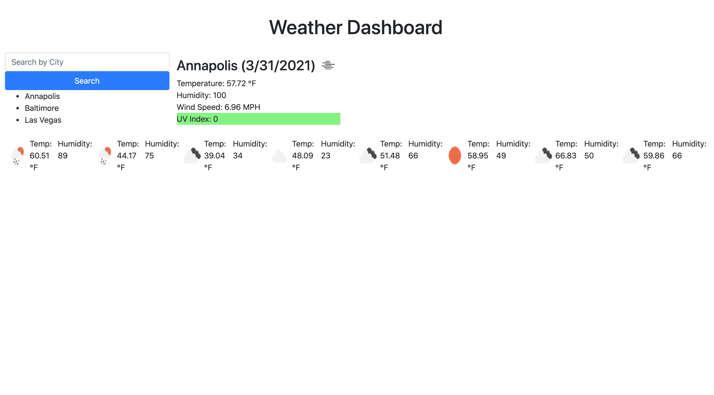

# weather-dashboard

https://rjpotere.github.io/weather-dashboard/

Here we have a weather dasboard which calls to the open weather API. When the API is called, you are presented with today's date, temp., humidity, and the uv index, which is color coded to display a color based on the uv index. 

Once the user searches for a city, the user's search is then saved to local storage (local storage search results are only displaying on renfresh, need to come back to fix.)

The user is presented with the future forcast (need to come back to only show 5 days and input the date for each future weather display.)

;
